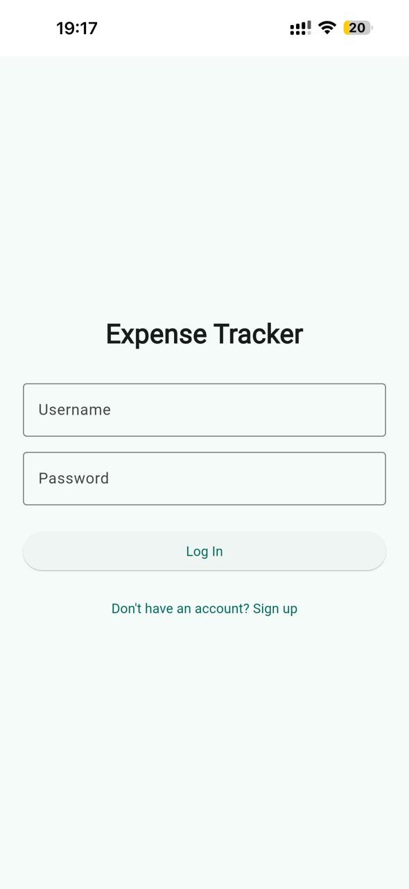
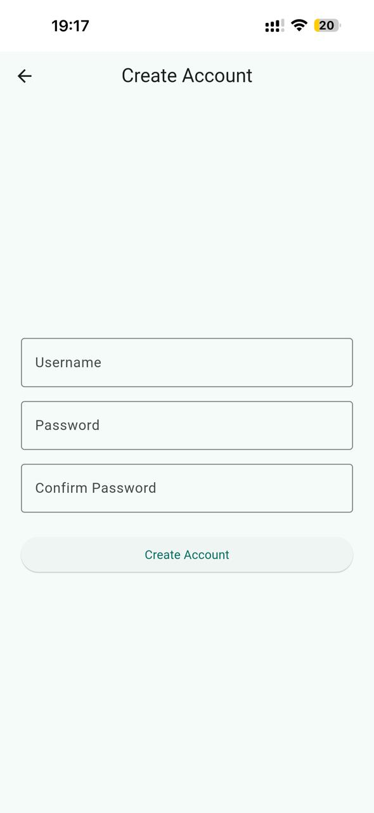
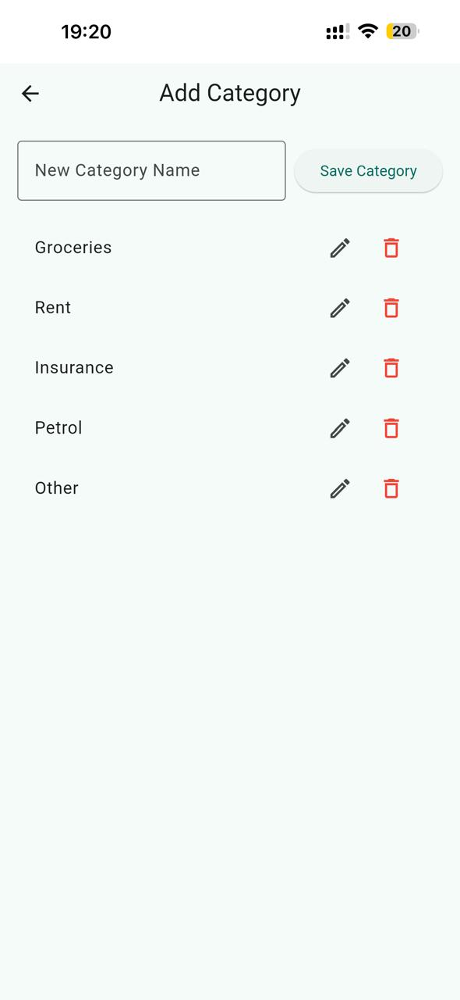
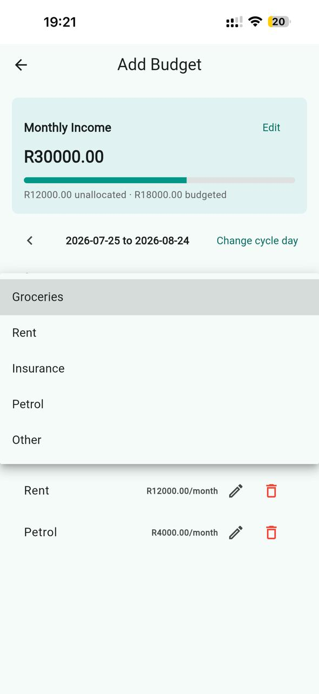
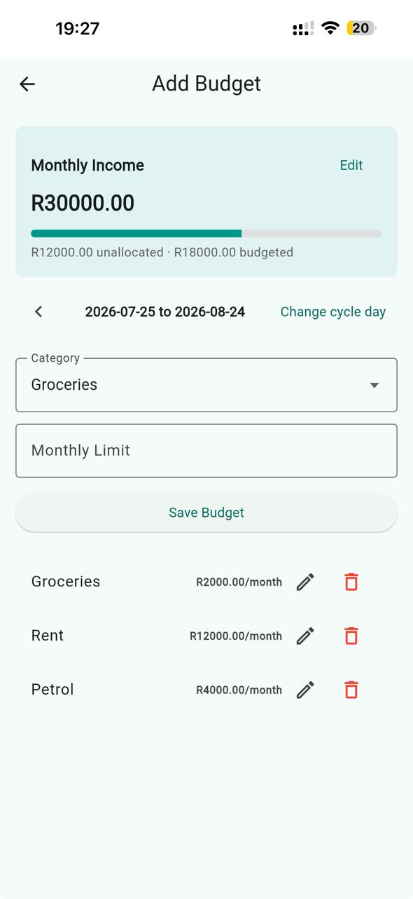
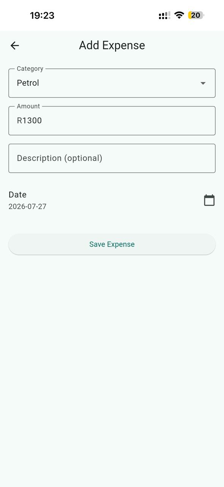
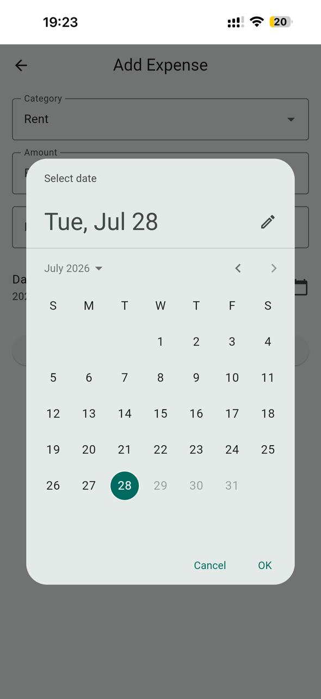
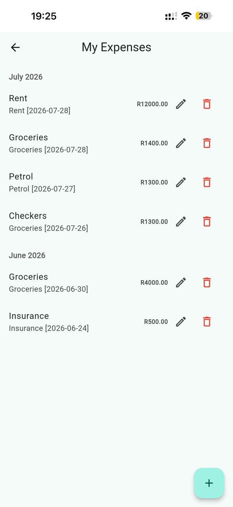

# Expense Tracker

A full-stack personal expense and budgeting application built with **Flutter**, **Django REST Framework**, and **PostgreSQL**. Built as a portfolio project to demonstrate end-to-end full-stack development: a relational database, a documented REST API, JWT authentication, and a responsive Flutter frontend, deployed and publicly accessible.

**Live app:** https://expense-tracker-tan-two-77.vercel.app
**API documentation (Swagger):** https://expense-tracker-api-ut1p.onrender.com/api/docs/

> The backend is hosted on Render's free tier, which spins down after a period of inactivity. The **first** request after some idle time (e.g. logging in) can take 30–60 seconds to respond while the server wakes up. This is expected — please be patient on first load.

### Try it yourself

You're welcome to register your own account, or use the demo account below (its data is visible to anyone who logs in with it, so please don't enter anything sensitive):

- **Username:** `demo`
- **Password:** `Test1234`

---

## Screenshots

**Log in**  
**Create account** 
**Categories**  
**Budgets — category selection** 
**Budgets** — income allocation, cycle period, and per-category limits  
**Add expense** 
**Add expense — date picker**  
**Expenses — grouped by month** 
**Dashboard — current period**, with budget progress bars and category breakdown  
**Dashboard — previous period** (read-only, no budgets were set for this period) ![Dashboard for a previous period] (screenshots/10-dashboard-previous-period.png) |

---

## Features

- **JWT authentication** — register, log in, and log out, with secure token-based session handling
- **Expenses** — full create/read/update/delete, grouped by month, with category and date
- **Categories** — user-defined, with duplicate-name protection
- **Budgets tied to custom pay-cycle periods** — rather than assuming a calendar month, each user can set which day of the month their budgeting period starts on (e.g. payday on the 25th). Budgets are scoped to a specific period, so:
  - the current period is calculated automatically and always up to date
  - past periods can be browsed (read-only) without affecting current data
  - editing a budget in the current period never rewrites the numbers from a previous period, preserving historical accuracy
- **Monthly income tracking** — set a monthly income and see it visually allocated across your budgets, with a running "unallocated" total
- **Dashboard** — total spend, a category breakdown pie chart, and per-category budget progress bars (spent vs. limit, colour-coded, with an "over budget" state), all scoped to whichever period you're viewing
- **Self-documenting API** — every endpoint is browsable and testable via an auto-generated Swagger UI (`/api/docs/`), built with `drf-spectacular`
- **Data isolation** — every API endpoint is scoped to the logged-in user; no user can ever see another user's data

---

## Tech stack

**Backend**
- Django 6 + Django REST Framework
- PostgreSQL (via Neon in production, local Postgres/pgAdmin4 for development)
- JWT authentication (`djangorestframework-simplejwt`)
- `drf-spectacular` for OpenAPI/Swagger documentation
- Gunicorn + WhiteNoise for production serving
- Deployed on Render

**Frontend**
- Flutter (web build)
- `http` for API communication
- `shared_preferences` for token storage
- `fl_chart` for the dashboard pie chart
- Deployed on Vercel

---

## Architecture notes

A few deliberate design decisions, in case they come up:

- **Budgets are period-scoped, not just category-scoped.** Each `Budget` record is tied to a specific `period_start` date rather than being a single permanent value per category. This was a direct fix for a real problem encountered while using the app: without it, a budget's "amount spent" would keep accumulating across every month forever, and editing a budget would silently rewrite history. Each period gets its own budget records, so past periods stay accurate even after the current period's numbers change.
- **Category names on expenses are always "live", not snapshotted.** If you rename a category, every past expense in that category will show the new name. This was a deliberate choice over the alternative (freezing the category name at the time of the expense) — for a personal tracker, most people renaming a category expect the change to apply retroactively, not to create a second, disconnected label.
- **Server-side date calculation for periods.** The "which period am I in right now" calculation is deliberately performed by Django (`get_current_period_start` in `expenses/utils.py`), not trusted from the client, since the server should be the source of truth for anything time-sensitive.
- **Validation happens on both the frontend and backend.** Flutter validates input for fast, friendly feedback (e.g. duplicate category names, invalid amounts); Django re-validates everything independently, since client-side checks can always be bypassed.

---

## Project structure

```
expense-tracker/
├── backend/
│   ├── config/            # Django project settings and URL configuration
│   ├── expenses/          # Main app: models, serializers, views, URLs
│   │   ├── models.py       # Category, Expense, Budget, Income
│   │   ├── serializers.py
│   │   ├── views.py
│   │   ├── urls.py
│   │   └── utils.py        # Budget period calculation logic
│   ├── requirements.txt
│   └── Procfile
└── frontend/
    └── lib/
        ├── models/          # Dart data models (Expense, Category, Budget, Income)
        ├── screens/         # Login, register, dashboard, expenses, categories, budgets
        ├── services/        # api_service.dart — all backend communication
        └── utils/           # budget_period.dart — shared period-calculation logic
```

---

## Running locally

### Backend

```bash
cd backend
python -m venv venv
venv\Scripts\activate        # Windows
pip install -r requirements.txt
```

Create a `.env` file inside `backend/` with:

```
DB_NAME=expense_tracker_db
DB_USER=postgres
DB_PASSWORD=your_local_postgres_password
DB_HOST=localhost
DB_PORT=5432
SECRET_KEY=any-local-development-key
DEBUG=True
CORS_ALLOWED_ORIGINS=http://localhost:5000
```

Then:

```bash
python manage.py migrate
python manage.py createsuperuser
python manage.py runserver
```

The API will be available at `http://127.0.0.1:8000/api/`, with interactive docs at `http://127.0.0.1:8000/api/docs/`.

### Frontend

```bash
cd frontend
flutter pub get
flutter run -d chrome --web-port=5000
```

By default, `frontend/lib/services/api_service.dart` points `baseUrl` at the deployed Render backend. To test against a local backend instead, change it to:

```dart
static const String baseUrl = 'http://127.0.0.1:8000/api';
```

---

## Deployment

- **Database:** [Neon](https://neon.tech) (PostgreSQL, free tier)
- **Backend:** [Render](https://render.com) — auto-deploys on every push to `main`
- **Frontend:** [Vercel](https://vercel.com) — deployed as a static build (`flutter build web` → `vercel --prod` from `build/web`); **not** connected to auto-deploy from git, so frontend changes require a manual rebuild and redeploy

Required environment variables on Render: `DATABASE_URL`, `SECRET_KEY`, `DEBUG`, `ALLOWED_HOSTS`, `CORS_ALLOWED_ORIGINS`.

---

## Known limitations & possible future improvements

Being upfront about the rough edges and what I'd tackle next:

- **Vercel isn't connected to auto-deploy.** Every frontend change currently needs a manual `flutter build web` + `vercel --prod`. Connecting Vercel directly to the GitHub repo (with a custom build step for Flutter) would remove this manual step.
- **Some date/grouping logic is duplicated** between `home_screen.dart`, `dashboard_screen.dart`, and `budgets_screen.dart` (e.g. month-name lookups, period filtering). A good next refactor would be consolidating these into shared helpers in `utils/`, similar to what's already been done for `budget_period.dart`.
- **Render's free tier cold starts** mean the first request after inactivity is slow. Acceptable for a portfolio demo, but a real production deployment would use a paid tier or a different always-on host.
- **No pagination** on expense lists — fine at personal-use scale, but would need addressing for a larger dataset.
- **No password reset flow** — registration and login exist, but there's no "forgot password" path yet.

---

## Why this project

Built as a portfolio piece to demonstrate practical full-stack skills: relational data modelling, a properly authenticated and documented REST API, state management and API integration in Flutter, and a real deployment pipeline across three separate hosting providers — including debugging genuine, real-world issues along the way (CORS configuration, environment-specific bugs, database migration mismatches between local and production, and a from-scratch redesign of the budgeting logic after finding a real flaw in the original design).